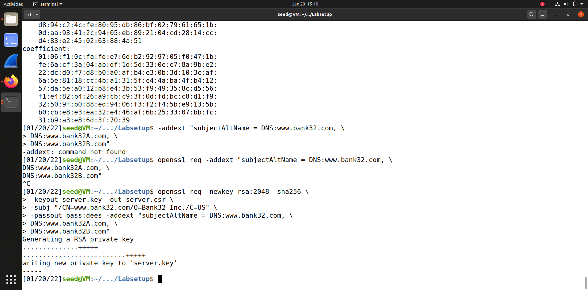

# LOGBOOK 11
## SEED-LABS
### Task 1

## Task 1: : Becoming a Certificate Authority (CA)

* Nesta tarefa o objetivo é tornanos um root CA e de seguida certificarnos para esse CA, isto é, o certificado é self-signed

* Para conseguirmos gerar o certificado self-signed tivemos de coorer diversos comandos: 
 > copiar o ficheiro OpenSSL **m /usr/lib/ssl/openssl.cnf** para o nosso diretório
 > correr o comando ** openssl req -x509 -newkey rsa:4096 -sha256 -days 3650 \ -keyout ca.key -out ca.crt** que iremos obter dois ficheiros o **ca.key** que contém a chave privada de CA e **ca.crt** que contém a chave pública

 * De seguida executamos dois comandos: 
  >openssl x509 -in ca.crt -text -noout
  >openssl rsa -in ca.key -text -noout

em que obtemos informação para respoder às seguintes perguntas

* Question 1: What part of the certificate indicates this is a CA’s certificate?

 > CA:TRUE
 

* Question 2: What part of the certificate indicates this is a self-signed certificate?
 >Signature Algorithm: Subject: CN = www.modelCA.com, O = Model CA LTD., C = US
 vemos que a chave é produzida por CN que é igual a www.modelCA.com, logo sabemos que é self- signed certificate
  

* Question 3: In the RSA algorithm, we have a public exponent e, a private exponent d, a modulus n, and two secret numbers p and q, such that n = pq. Please identify the values for these elements in your certificate and key files.

Obtemos então:
 
 > modulus (n):
    00:c1:71:e4:f0:a2:cf:49:fe:e4:09:9e:1b:bb:a1:
    c1:0d:8f:ed:4e:47:37:72:8c:7d:9e:9a:cf:3b:4d:
    77:28:65:28:d3:9b:fb:e6:c1:dc:3a:cc:5f:7d:3b:
    af:03:79:6e:a2:cd:78:a3:64:12:df:2c:98:d7:1f:
    ca:e0:1f:ec:b9:6a:76:6d:d9:5c:81:dc:ca:49:c1:
    f2:fc:b9:7b:d6:24:9e:b3:4b:12:61:05:cd:ec:8f:
    34:0f:82:96:7d:82:70:4a:e9:5e:7e:a1:58:36:0f:
    32:40:c4:91:5e:7e:74:ad:8e:ec:ae:57:27:88:6d:
    37:15:17:b7:45:a7:56:f6:2a:09:fd:d1:3b:44:fa:
    87:c0:ac:b3:81:4d:28:1b:88:98:95:50:17:d7:3a:
    23:47:13:3f:59:a2:65:1a:b4:ea:f6:c8:ac:c3:c6:
    46:b5:f4:47:2a:3b:59:14:c2:9d:75:a1:4e:ac:30:
    e0:d6:2c:42:1a:33:a1:b3:5c:b5:40:49:b5:13:d9:
    85:77:69:b7:82:5d:e0:20:95:9c:ee:70:d8:02:cf:
    d5:36:7b:ff:df:38:af:aa:2e:c5:00:41:de:13:42:
    dd:34:db:81:3d:39:96:53:b8:60:e6:11:89:9f:23:
    20:6b:93:76:e6:06:59:c8:ab:69:e7:6e:33:38:d9:
    65:c1:2d:25:dd:15:6e:ef:0d:c6:b0:f2:81:64:7d:
    36:cc:f5:f1:ae:ea:65:01:bd:fa:a7:1e:9f:bd:e7:
    90:b3:6d:77:21:2c:75:71:14:3a:39:1e:07:72:4a:
    ce:43:30:f9:26:d0:77:49:77:2f:ec:b1:14:f0:db:
    ab:40:d0:b7:fe:ed:0c:37:1a:7d:2d:98:44:89:66:
    31:95:ad:c9:5d:6f:7b:ce:ab:08:65:bc:f8:f7:02:
    19:d0:08:30:68:e0:d5:95:f7:fd:d1:0f:c5:26:65:
    7e:76:6a:5d:ae:a9:8e:9c:e0:58:f3:d9:ec:9e:4f:
    ae:52:60:71:ec:9a:ac:5d:f9:58:55:99:2d:dc:a8:
    4e:35:3b:5f:40:25:52:85:e7:3e:31:bc:4c:52:64:
    4b:2d:8d:48:8f:82:91:62:ec:f6:ed:d3:ff:96:50:
    e0:fb:4c:21:9c:b1:1f:93:fa:47:53:e8:5a:4f:f4:
    2e:14:79:10:4a:44:b4:17:92:61:bd:a0:7d:62:a0:
    49:55:14:ed:9f:d7:09:4c:fc:3e:84:d7:b2:e5:52:
    15:19:22:39:bf:4e:97:2b:11:ba:f8:80:60:8f:b4:
    6c:b1:10:86:9c:a3:5d:aa:56:ab:f9:cc:d6:c9:11:
    e5:7b:f4:db:d3:e5:56:40:68:40:87:7a:88:47:4e:
    2e:b5:05
> publicExponent: 65537 (0x10001)
> privateExponent:
    00:9b:6b:14:53:39:9b:6d:89:fa:50:b7:d4:f4:45:
    1b:43:f8:34:e2:c5:59:09:11:53:04:10:c1:1a:96:
    3c:7c:19:fa:59:39:63:83:9c:91:82:34:1d:2c:12:
    bd:a3:fe:f6:22:9b:0e:a7:c7:89:5a:01:0c:b3:19:
    f9:f7:63:ee:df:71:67:c1:0d:f7:c2:e6:4f:28:3f:
    49:28:3f:25:fd:80:e2:78:8e:82:2f:ad:68:2a:fd:
    4b:08:83:14:c1:b6:00:de:4e:ec:fa:b4:4a:98:f4:
    50:9d:b4:d0:4e:a9:2e:b9:1a:b1:91:c8:b8:1c:66:
    12:f1:41:62:9f:f5:b8:6a:82:90:10:7b:00:31:85:
    4f:78:3f:c8:e0:c3:ca:cb:84:4d:82:f9:1c:8e:71:
    49:52:9b:66:34:6f:c2:e7:58:1f:c7:32:a7:8b:8b:
    4b:d8:78:70:8c:bf:ad:ec:7e:07:e0:30:3f:73:1c:
    ba:27:98:db:6b:0d:bc:86:cc:9f:5b:0d:5d:0c:9b:
    a1:1d:b5:b4:18:6b:af:dc:be:17:9d:82:d0:2a:42:
    2c:bd:5f:96:ce:13:4f:1f:5e:00:2d:1a:be:7f:9f:
    22:f6:8a:bd:25:21:95:63:a2:29:47:ef:23:30:d6:
    1a:00:14:34:5c:cf:11:67:a6:40:aa:0d:e1:dd:74:
    dc:c8:94:b5:d6:06:17:ce:9a:ef:86:68:c4:87:09:
    83:f3:83:52:c1:a6:fb:fb:ed:e2:4d:68:74:c6:0e:
    ce:e4:80:4c:02:c8:40:f4:00:91:7a:ae:19:da:ec:
    03:86:0e:e8:69:00:62:b3:37:c4:a0:4d:11:9c:17:
    a9:36:15:26:a8:5d:67:a0:37:58:12:14:2d:32:e7:
    49:65:ca:45:69:3f:81:4e:76:08:35:26:b2:57:46:
    d6:cd:53:e0:5d:73:1a:e4:34:b2:f7:62:1a:77:1d:
    92:60:8e:ac:6f:5b:78:97:5d:2c:b9:b9:1a:c4:4f:
    38:61:be:76:95:9b:b8:e7:a2:eb:8b:e9:9d:09:31:
    70:6d:74:3a:95:d9:f9:97:7b:90:81:fe:1d:8d:9a:
    f1:d6:59:e6:44:48:76:97:cc:d1:6f:7f:a8:f8:06:
    66:7f:26:ee:77:88:21:4c:1d:ed:23:10:4b:94:c8:
    9c:e3:1d:ff:c6:3d:86:ff:d4:35:3b:41:b0:c4:f4:
    33:d3:4f:f0:42:e3:12:6d:2d:31:1c:4b:fc:3f:dd:
    05:d7:ca:73:9f:c8:53:81:49:04:b2:24:e6:ca:c7:
    61:97:b0:75:80:0b:ce:19:12:9c:a2:10:37:ae:46:
    f7:0e:35:72:fc:e9:15:71:34:76:f3:d4:54:44:4b:
    d5:eb:e9
> prime1 (p):
    00:ff:46:82:a8:23:39:35:3a:9b:83:bd:05:8b:c6:
    aa:55:2e:77:69:21:93:44:8e:2a:bd:f7:81:6c:c8:
    f1:52:42:3b:8f:22:a2:e5:10:b0:42:a5:a1:87:4d:
    d7:31:67:f9:85:96:f1:92:ef:ca:fe:fd:0f:07:fc:
    1c:39:fa:34:6a:29:56:77:32:13:66:70:96:f2:ff:
    01:74:09:b9:b4:ee:28:87:91:3d:64:e0:20:a5:7d:
    17:14:64:97:49:06:1a:69:5f:d2:6c:38:79:b6:38:
    40:15:0c:7e:1f:e1:d4:dc:cf:e6:83:96:1e:80:9d:
    60:85:11:3d:4d:de:5f:de:ba:0c:d7:32:c9:bc:e0:
    ee:32:64:03:bf:51:4f:12:53:f2:64:b4:07:ac:6d:
    57:b5:74:94:27:b0:2d:e7:1c:94:b7:3a:05:ef:f7:
    d8:34:22:8e:49:39:0c:04:7e:dd:c1:ad:70:fe:06:
    a3:25:dd:83:5e:39:f9:26:62:30:3c:f8:80:4c:55:
    76:97:62:f6:0b:3e:d1:7b:6b:81:89:3e:65:29:1f:
    26:0e:d1:5b:d0:16:ff:ce:78:82:08:eb:2e:fe:fa:
    e3:1a:1e:9c:8b:62:ba:91:d0:27:65:49:b4:97:fd:
    60:e9:8c:6d:e7:d5:9c:fd:1e:25:7b:ad:e1:35:49:
    73:77
> prime2 (q):
    00:c1:fe:74:ce:e0:1f:47:2f:43:51:71:f1:53:6b:
    a8:44:38:24:36:cc:c4:51:31:ee:a6:0e:32:b8:09:
    36:7e:bc:cf:cf:f7:72:d2:39:60:df:df:35:99:c8:
    bc:e3:94:5d:e5:ef:36:89:57:ca:18:4d:1a:d9:e4:
    30:14:a6:e9:c5:ee:aa:26:7e:f8:e1:27:0f:b4:eb:
    6f:1c:79:54:24:eb:7e:7c:e4:7c:a5:44:9d:41:ed:
    f6:e8:d1:c5:e3:57:ff:cd:b5:a7:05:8e:98:0c:ea:
    e0:1b:51:b9:69:48:f6:3b:81:65:22:81:e1:56:d6:
    49:27:54:41:e0:3e:b9:71:d5:e6:8f:82:63:1e:a4:
    ee:b8:45:ef:28:bc:c7:c2:9a:e4:a7:89:74:61:ee:
    07:6a:a5:44:7e:8a:e5:99:eb:fc:52:6f:78:71:05:
    45:37:b0:2f:0e:40:92:a4:02:50:4c:81:f6:cb:34:
    94:b7:2c:ba:40:c1:cb:e8:b8:94:99:70:0f:eb:1b:
    2f:5d:68:08:58:28:7d:d1:c1:29:93:01:70:5f:3b:
    23:f9:c4:d0:12:2b:ae:27:2d:5d:b6:2e:bc:49:87:
    01:cf:54:7b:6c:bb:8f:db:ef:50:a0:31:9d:6e:ff:
    ee:e0:3f:41:4a:c4:3c:b9:ac:52:f2:4c:95:41:e8:
    e2:63

# Task 2:  Generating a Certificate Request for Your Web Server

* Esta tarefa tem como objetivo gerar um CSR, em que contem a chave externa de uma companhia e a informação de identificação, para gerir essse certificado executamos o seguinte comando: 
 >openssl req -newkey rsa:2048 -sha256 \
-keyout server.key -out server.csr \
-subj "/CN=www.bank32.com/O=Bank32 Inc./C=US" \
-passout pass:dees

* Para saber de informação da nossa CSR podemos executar os segunites comandos: 
 >openssl req -in server.csr -text -noout

 >openssl rsa -in server.key -text -noout

* Por fim, adicionar os nomes alternativos, isto é, url diferentes mas que vão apontar para o mesmo servidor, e assim executamos o seguinte comando: 

> openssl req -newkey rsa:2048 -sha256 \
-keyout server.key -out server.csr \
-subj "/CN=www.bank32.com/O=Bank32 Inc./C=US" \
-passout pass:dees -addext "subjectAltName = DNS:www.bank32.com, \
DNS:www.bank32A.com, \
DNS:www.bank32B.com"

# Task 3: Generating a Certificate for your server

* Esta tarefa tem como objetivo criar um certificado através do ficheiro CSR para ter a assinatura CA

/*
Não sei se queres por isto 
>mkdir demoCA

>touch index.txt

>touch serial.txt
*/

* Por razões de segurança o ficheiro OpenSSL copiado da task1 temos comentado o comando **copy_extensions** e para conseguir executar o comando para assinar o certificado temos que descomentar e de seguida podermos executar o comando:
> openssl ca -config myCA_openssl.cnf -policy policy_anything \
-md sha256 -days 3650 \
-in server.csr -out server.crt -batch \
-cert ca.crt -keyfile ca.key

* E assim obetemos o certicado assinado, e podemos observar o decoded conteúdo do certificado com o seguinte comando:
> openssl x509 -in server.crt -text -noout

Obtemos o decoded conteúdo do certificado, sendo este o print da nossa tela:

### Task 4: Deploying Certificate in an Apache-Based HTTPS Website

* Nesta tarefa era pedido para correr um servidor baseado em apache2 e tentar aceder a este com recurso ao mozila.
* Para tal usamos o ficheiro fornecido ``bank32_apache_ssl.conf``.
* Corremos o servidor com o comando ``service apach2 start`` e tentamos aceder ao website ``https://www.bank32.com``.
* Como era de esperar o browser deu nos um aviso de segurança e não abriu o site, para o abrirmos será preciso importar o ficherio ``ca.crt`` criado na tarefa 1.

Print depois de importado o certificado:

### Task 5: Launching a Man-In-The-Middle Attack

* Nesta tarefa era pedido para causar um ataque "Man In The Middle" ou seja que consigamos receber e trocar informações do utilizador passando nos por um browser fidedigno e depois enviar esses mesmos dados para o site original de maneira a obter as respostas corretas ao que foi enviado para o usuario não reparar na nossa presença.
* Como tal devemos escolher um site muito utilizado, optamos pelo ``twitter.com``.
* Alteramos no ficheiro fornecido na tarefa 4 a linha ``ServerName`` para ``twitter.com`` e apagamos as linhas do ``ServerAlias`` visto estas já não serem necessárias.
* Acrescentamos no ficheiro ``/etc/hosts`` a linha ``10.9.0.80 www.twitter.com``.
* Procedemos de seguida a tentar aceder ao site, mas como era de esperar o browser deu nos um erro, isto é, disse que a ligação não era segura/que o site não era confiavel, pois os certificados não estavam associados ao ``twitter.com``.

### Task 6: Launching a Man-In-The-Middle Attack with a Compromised CA

* Nesta tarefa era pedido para realizar a tarefa anterior mas sem o utilizador reparar que está a acontecer algo de errado.
* Para tal foi criado um novo servidor associado ao endereço ``twitter.com`` e de seguida adicionado ao container.

Prints ilustrativos do ponto anterior:

* Depois de tudo voltamos a tentar aceder ao website ``twitter.com``.

Print do ecrã depois de aberto o twitter com successo:

