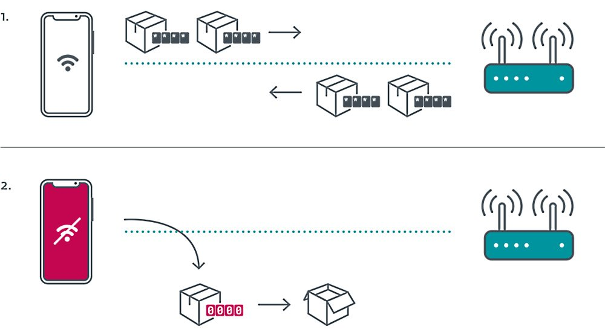

# CVE-2019-15126

## Identificação
* Foi uma falha que afetou clientes Wi-Fi da *Broadcom* que causava transições de estados não intencionais.
* Está vulnerabilidade permite a *attackers* facilmente decriptar pacotes de rede trasmitidos por aparelhos que foram expostos ao exploit, por  forca-los a utilizar chaves de criptografia *all- zero* para os dados transmitidos.
* Uma grande parte dos utilizadores afetados utilizavam software da apple, da samsung e da amazon.

## Catalogação
* Este CVE foi divulgado por meados de agosto de 2019.
* É um CVE com nível de gravidade igual a **3,2**.
* Foi descoberto por Robert Lipovsky e Stefan Svorencik, enquanto trabalhavam na [ESET](https://en.wikipedia.org/wiki/ESET).

## Exploit
* Este script é uma simples experimentacao do exploit da  vulnerabilidade KR00K (CVE -2019- 15126), que permite decriptar dados WPA2 CCMP de aparelhos vulneráveis. https://www.exploit-db.com/exploits/48233
* O script a seguir é uma _**PoC** (Proof of Concept)_  do CVE 2019-15126, onde é nessecario saber dois pontos de acesso,o canal e mac address da vítima. https://github.com/hexway/r00kie-kr00kie

## Ataques
* Podia se utilizar esta falha para coletar dados transmitidos pela rede wi-fi de um cliente, que na sua maioria seria informação com pouco calor monetário.
* Outra forma de Ataque seria simplesmente não deixar o usuário aceder à rede, o que pode ser usado, por exemplo, para chantagem.

\
Temos aqui uma imagem sobre o functionamento do software. No ponto **1.** está representada o trafego de informação entre um utilizador (telemóvel) e um router. No ponto **2.** Depois de corrido um script e o trafego de dados ser redirecionado para o *attacker*.

