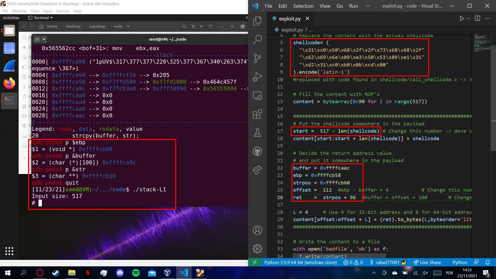

# LOGBOOK5

## SEED LABS
### Tarefa 1
* Correndo "Make" no terminal são compilados 2 programas *a32.out* e *a64.out*, um corre a shell em 32 bits e a outra em 64 bits, respetivamente. Não há diferenças visiveis nos dois programas.

### Tarefa 2
* Compilamos os programas sem problemas

### Tarefa 3
* Para esta tarefa precisavamos de um shell code em codigo maquina que fomos buscar ao ficheiro call_shellcode.c - utilizamos o de 32 bits.
* Precisamos tambem de saber o endereço do buffer na memória e o de EBP para determinar a distancia - *offset* - a usar. Usamos o gdb de com um breakpoint em bof para os descobrir (p $ebp -> 0xffffcae8; p &buffer -> 0xffffca7c). Calculamos a diferença e somamos 4, 4 pois estamos a trabalhar em 32 bits.
* O valor do start não é muito relevante pois apenas vai colocar o shellcode nessa posição da string, se tudo estiver correto qualquer valor que coloque o shellcode depois do endereço de retorno e, obviamente, dentro da string que vai ser copiada para "cima" do buffer deve funcionar. O resto da str é coverto por NOP ou seja a maquina vai realizar o comando que se encontra a seguir, o que é outro NOP até chegar ao shellcode. Assim, de modo a termos mais margem colocamos o shellcode no fim da string a copiar, isto é: **start = 517 - len(shellcode)**.
* Colocamos o valor do **ret = &str + 96** pois queremos que vá para o inicio string copiada para "cima" do buffer, o valor 96 veio depois de uma pequena pesquisa sobre o gdb, normalmente as variaveis ficam com um offset de 96 bytes devido as variaveis extra que o gdb usa.

## CTFˆ

## Desafio - 1
* Modificamos o exploit-exemplo.py para enviar uma string com 20 caracteres quaisquer seguido  o nome do arquivo "flag.txt".
* Inicialmente tentamos testar o script localmente , entretanto como estavamos a  usar Mac (Uma vez que o "program" binaraio  é para  x86), modificando "./program" para "./a.out". 
Compilamos a "main.c" com o comando " gcc main.c", e nao conseguimos exploplar a vunerabilidade de buffer overflow stack.
* Tentamos copilar novamente "gcc main.c -fno-stack-protector" afim de desabilitar a flag de protecao da stack. Desse modo o conseguimos obter o conteudo do arquivo "flag.tx" local ("flagplaceholder")
* Apos isso trocamos o valor variavel DEBUG para False, com o objetivo de acessar a serviço se encontra à escuta na porta 4003 do host ctf-fsi.fe.up.pt. E obtivemos a flag.

## Desafio - 2
* O segundo desafio muito similar ao primeiro, notamos que havia mais 4 bits que deveriam ser modificados/acessados atraves do buffer over flow que deria ter o valor 0xfefc2122 ao ser transformado para long afim de abrir o arquivo.
+ Entao substuimos o seguinte comando no exploit-exemple.py:
 "r.sendline(b"12345678901234567890\x22\x21\xfc\xfeflag.txt")" 
 Desse modo a variavel " char var[4]" teria o valor 0xfefc2122.

