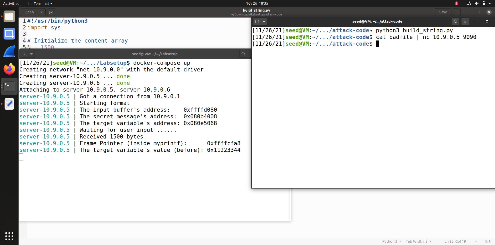
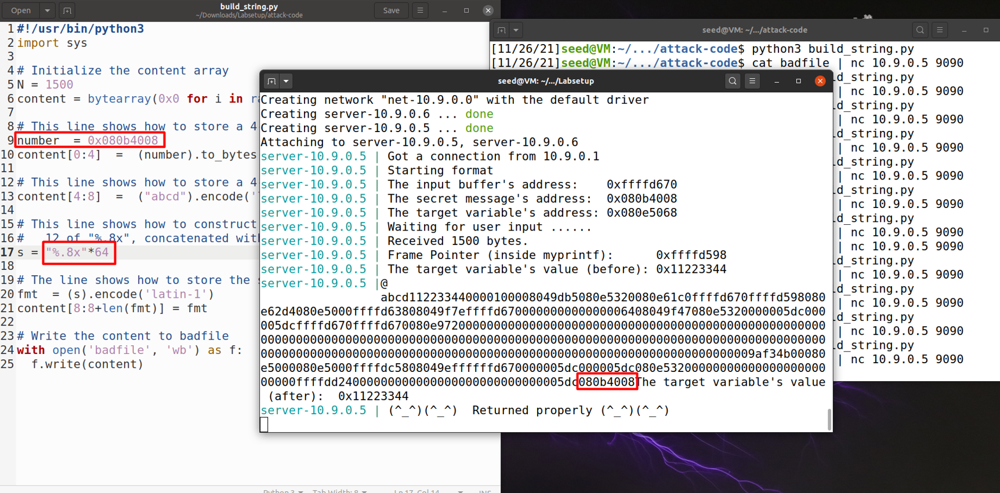
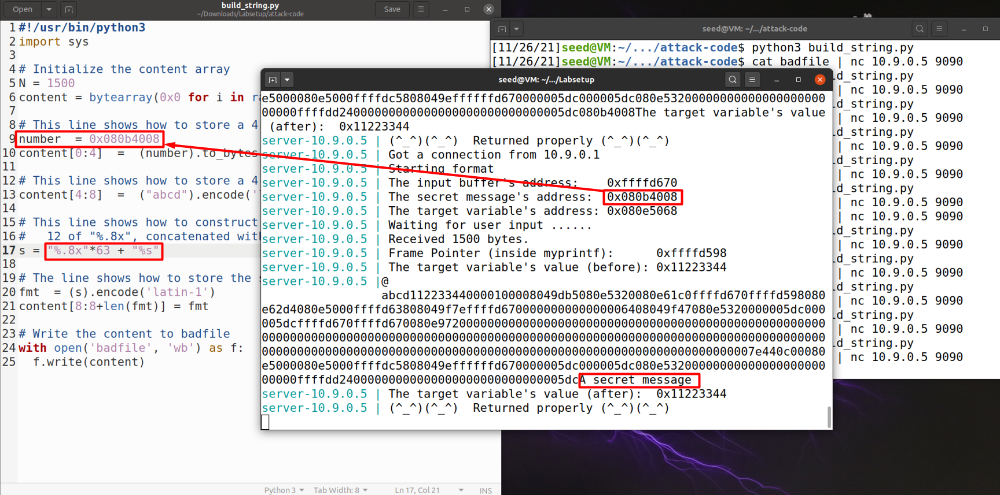
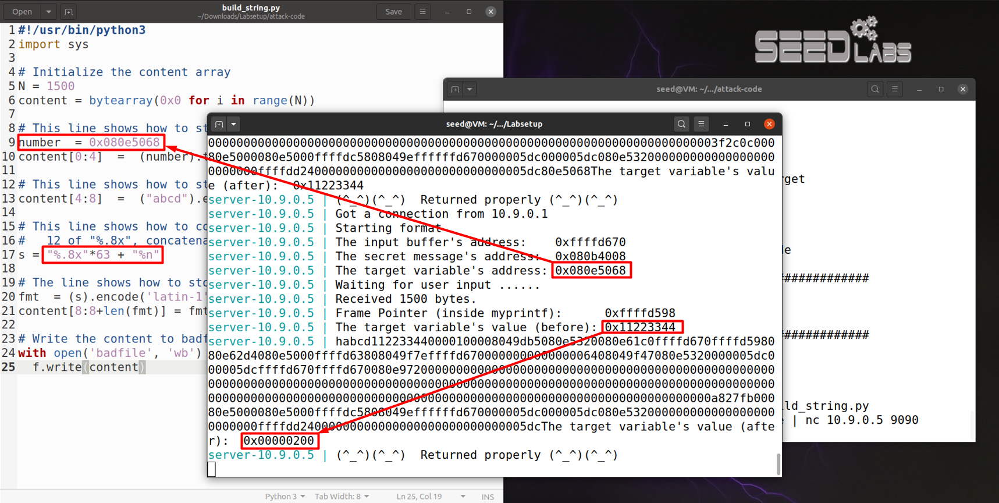
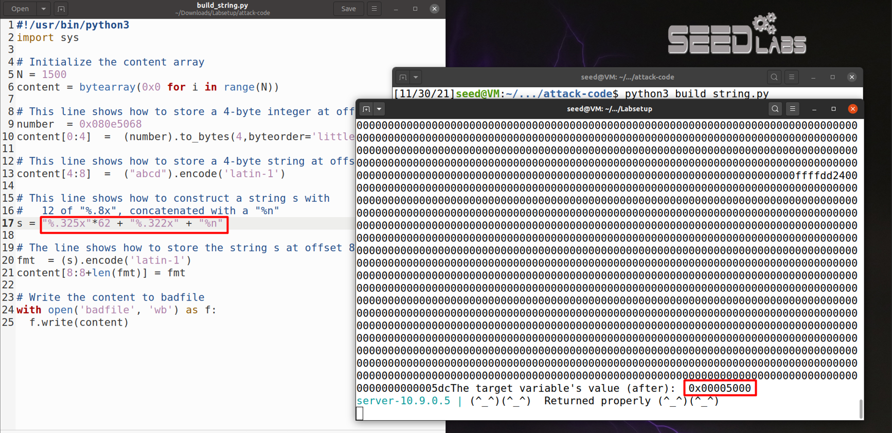
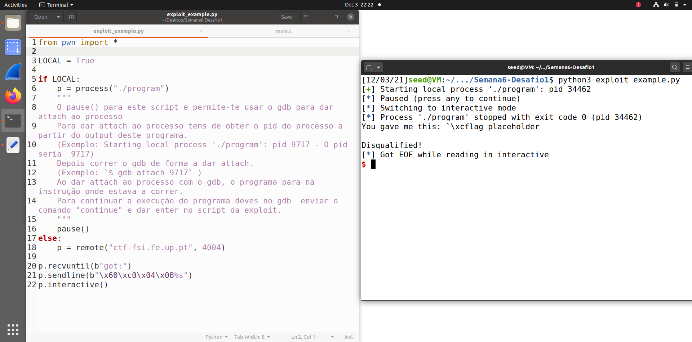
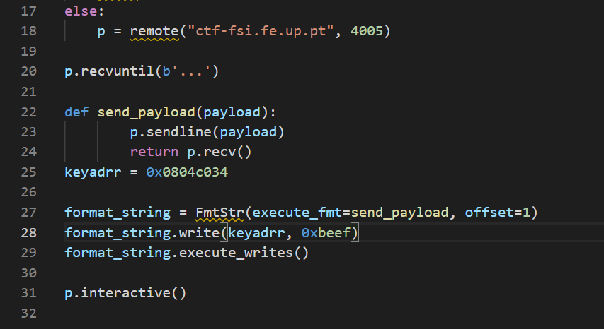

# SEED-LABS

## Task 1

* Para começar a trabalhar tivemos de executar diversos comandos que se encontram no ponto *2. Environment Setup*.
* A tarefa deste de exercicío é fornecer um input que crash o programa, para isso usamos o programa em python **build_string.py**. Tentamos vários tipos de formatação de string, experimentamos *format specifiers* como "%d", "%s" e "%x", mas o programa retornava sempre com sucesso, de seguida tentamos com "%n" e o programa "crashou"!
* Print do ecra depois de introduzido um input com "%n"

## Task 2

* A resolução destas tarefas utilizou-se o código no ficheiro *build_string.py* e num terminal separado o *docker compose* ligado a porta *10.9.0.5* tal como pedido.

### Task 2.A

* Nesta tarefa precisavamos de perceber quantos "%x" era necessários para imprimir o valor que está na variável *number* do nosso input, a nossa realização foi por tentativas começamos com um número elevado de "%x" e fomos diminuindo esse número. Quando experimentamos 64 *format specifiers* "%x" foi imprimida a nossa variavel passada ao programa!
* Print do ecra depois de corrido o script *build_string.py* com o código que se apresenta na imagem. Como é possível observar colocamos a variável ***number* = 0x080b4008** (é um valor específico usado para um exercício seguinte) e esta é imprimida no final do print.

### Task 2.B

* Neste exercício foi nos pedido para imprimirmos uma variável que já se encontrava definida no programa e também nos era fornecido o endereço dela.
* Para imprimir a "secrete message", como sabemos o endereço em que está essa mensagem secreta, utilizamos o raciocínio da *Task 2.A* com o conhecimento da *Task 1*. Substituimos o valor de *number* para o endereço da mensagem, sabendo que esse endereço seria lido depois de 63 *format specifiers* "%x", para imprimir esse endereço demos um input ao programa de ``"%.8x"*63 + "%s"``. 

## Task 3

* Nesta tarefa é importante perceber a definição de "%n" que conta o número de carateres antes de aparecer e guardada esse valor numa variável.

### Task 3.A

* Para mudificar o valor da *target* precisamos de seguir a lógica do exercício *Task 2.B*, isto é, por na variável *number* o endereço de *target* e, de seguida, colocar o *format specifier* "%n" na posiçãp certa para este mudar o que se encontra no endereço dado. Assim foi fornecido ao programa ``"%.8x"*63 + "%n"``

### Task 3.B

* Nesta tarefa pede para mudificarmos para *0x5000* o valor da mesma variável da *Task 3a*, dessa maneira tinhamos de mudificar o format string antes de concatenar com *%n* para que o total de carateres contados ser igual a *0x5000*.
* 0x5000 está em hexadecimal, em decimal ``0x5000 = 5 * (16 ^ 3)`` , isto é também igual a ``64 * (64 * 5)``, o problema é na quantidade de variáveis que temos antes da inserida por nós. Isto é, são lidas 63 posições de memória antes da inserida por nós, *0x5000 / 63* não é um número inteiro mas o quociente desta operação é 325, assim experimentamos dar o input de ``"%.325x"*63 + "%n"``. Neste caso o valor da variável foi alterado para 0x5003, logo seria só imprimir um valor com menos 3 carateres para termos o valor pedido.
* Assim, chegamos a uma string ``"%.325x"*62 + "%.322x" + "%n"`` para que a *target* fosse o valor desejado.

# CTF

## Desafio 1

* Para este desafio utilizamos conhecimento aprendido durante as tarefas da semana, nomeadamente a *Task 3*.
* Depois de corrido o *chechsec* para o programa fornecido reparamos que a randomização de endereços de memória estava desligada.
* Analisamos o codigo fonte do programa, reparamos que a variável que era lida através do uso do *scanf* era logo de seguida imprimida. Notamos também que havia uma variável global que lia o ficheiro *flag.txt* e guardava a flag desejada.
* Corremos o programa com o gdb para obter o endereço da variável *flag*
* Depois de recolhida esta informação a estratégia foi simples. Alteramos o exploit fornecido para enviar uma string que contém o endereço da variável e um *format specifier* "%s" para imprimir esta em formato string.

**Nota**: o endereço da variável ``flag`` não pode ser enviado da forma lida, isto é, tem de se alterar a ordem dos bytes pois a leitura de memória é feita ao contrário.

Disponibilizamos um print do script utilizado:

## Desafio 2

* Para superar este desafio foi necessário mais esforço que o anterior.
* Corremos *chechsec* para o programa fornecido e reparamos que a randomização de endereços de memória estava desligada (tal como no desafio anterior).
* De seguida analisamos o código fonte, deste código subressaem três detalhes:
    1. Há uma variável global, ``key``, que é inicializada sempre com o valor 0.
    2. É lida uma string com recurso ao *scanf* e, esta mesma string lida, é "imprimida" através do uso do *printf*.
    3. No final do código há umas linhas condicionais, isto é, estão envolvidas num ``if(key == 0xbeef)``, que permite ao *attacker* correr comandos shell!
* Corremos o programa com o gdb para obter o endereço da variável *key*
* Assim, para saber o valor da flag resposta temos de colocar a variável ``key = 0xbeef`` e correr um comando shell para obter a flag contida no ficheiro *flag.txt*, que se encontra no mesmo diretório do programa, um exemplo seria ``cat flag.txt``.
* Na parte da execução tivemos algumas dificuldades. Depois de muitas tentativas de resolução parecidas ao desafio anterior começamos a ler a documentação do modulo **pwntools** usado no exploit. Aí encontramos um site que continha um script em python perfeito para o nosso problema: https://docs.pwntools.com/en/stable/fmtstr.html.
* Adaptamos o script para o nosso objetivo e conseguimos a flag pedida!

Disponibilizamos um print do script utilizado:

