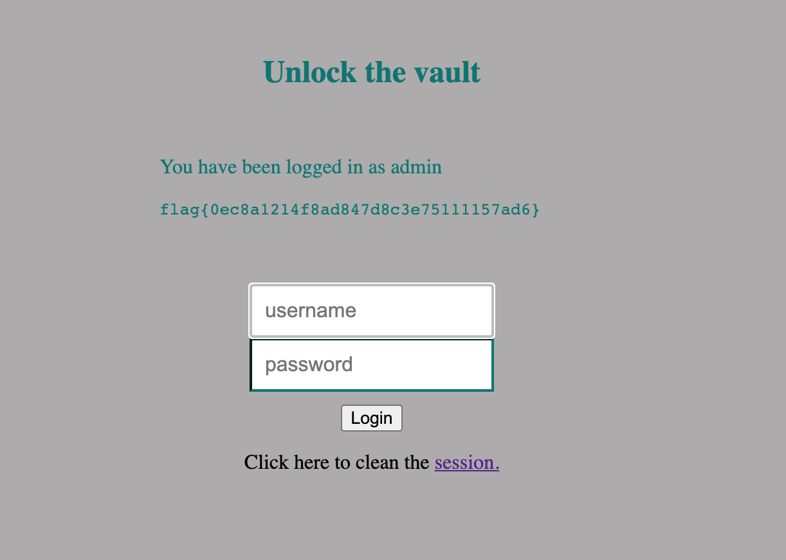
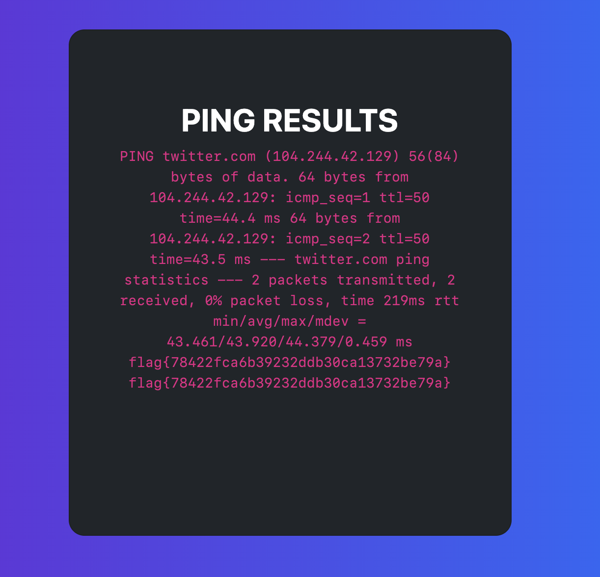

# SEED-LABS

## Task 1: Get Familiar with SQL Statements

* A primeira tarefa requeria que nós corressemos alguns comandos no terminal para evidenciar a forma de desenvolvimentos da base de dados, esta foi implementada em ``MySQL``.

Screenshot pedida com o resultado depois de corridos os comandos:

* Obtivemos os dados presentes na tabela ``credential``, esta continha informações sobre o nome, o employe ID, o salário, a data de nascimento, o número da segurança social e a hash da sua password. Podemos também filtrar os resultados pelos nome da alice para apenas se visualizar os seus dados.

## Task 2: SQL Injection Attack on SELECT Statement

### Task 2.1:  SQL Injection Attack from webpage.

* Nesta tarefa era nos pedido para entrarmos na aplicação web como o administrador para podermos ver as informações dos empregados.
* Com este objetivo em mente, visualizamos o código disponibilizado e detetamos uma falha na maneira em que as ``queries`` eram feitas ao servidor, isto é, os dados passados no parametro do login eram transmitidos para a base de dados como uma simples cópia de uma string.
* Assim para obtermos acesso como admin à aplicação web teremos de colocar no parametro de login algo que faça a ``query`` devolver o id do admin, ou seja, pode se dar um input de ``Admin' #`` para que seja encontrada uma linha da tabela com o username admin e seja descartado a hash da password.

Screenshot da aplicação web depois de introduzida a string "Admin' #" no login.

### Task 2.2: SQL Injection Attack from command line.

* Nesta tarefa era pedido para obter os mesmo dados da anterior mas apenas usando a linha de comandos.
* Para isso precisamos do url do website e de codificar o ``espaço``, o ``apostrofe`` e o ``cardinal`` para ascii de maneira a isto ser lido pelo servidor.

| símbolo | Ascii |
|:---:|:---:|
| ' | %20 |
| # | %23 |
|   | %27 |

* Assim, utilizando o comando curl, corremos ``curl 'www.seed-server.com/unsafe_home.php?username=Admin%27%20%23'`` na linha de comandos.

Screenshot da linha de comandos de introduzida o comando descrito a cima.

### Task 2.33: Append a new SQL statement.

* Não é possivel correr mais do que uma ``query`` SQL, pois a função ``PHP::Query`` só aceita um pedido por cada chamada à base de dados.

## Task 3: SQL Injection Attack on UPDATE Statement

### Task 3.1: Modify your own salary

* Nesta tarefa era pedido, para, através da pagina de empregado da Alice, alterar o seu próprio salário.
* Depois de analizado o código disponibilizado para a página de edição de perfil detetamos que poderiamos alterar o salário ao injetar código SQL na ``query`` de atualização da linha da alice.
* Assim colocamos no input para o email a seguinte string: ``ola1@mundo.pt', salary='12345' WHERE ID=1;#`` que teoricamente deve alterar o salário da Alice para 12345.

Screenshot da página web depois de introduzida a string descrita acima.

### Task 3.2: Modify other people’ salary.

* Nesta tarefa é pedido que através da conta da Alice alteremos o salario do chefe dela.
* Depois de analizado a base de dados notamos o id do chefe da Alice que é 2, assim alteramos a string anteriormente feita para o id do chefe e obtemos o pedido.

Screenshot da página web depois de introduzida a string ``ola1@mundo.pt', salary='12345' WHERE ID=2;#`` e entrando na aplicação web como admin.

# CTF

## Desafio 1
comandos:
* login = admin' or '1'='1--
* password = qualquer string 

Para modificar a consulta SQL na entrada "username".
Neste exemplo, usamos 'ou 1 = 1 -. Isso faz com que o servidor execute a consulta: 
SELECT * FROM users WHERE username = '' OR 1=1-- ' AND password = 'Tantofaz' 
Como a sequência de comentários (-) faz com que o restante da consulta seja ignorado, isso é equivalente a: SELECT * FROM users WHERE username = ' ' OR 1=1.

## Desafio 2
comandos:

* twitter.com && cat /flag.txt

 Ao testar o ping do -- twitter.com, verificamos que os logs eram similares aos  do comando "ping" do linux. Ou seja apos o nome do destino do commando, poderiamos inserir um comando logo a seguir. Desse modo,  como nos foi informado que  a flag esta no ficheiro /flag.txt só era preciso utlizar cat.  

